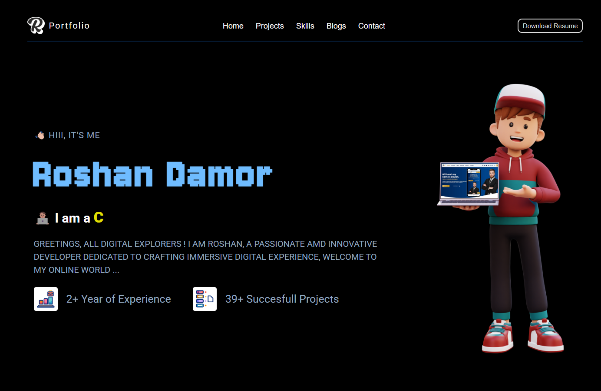
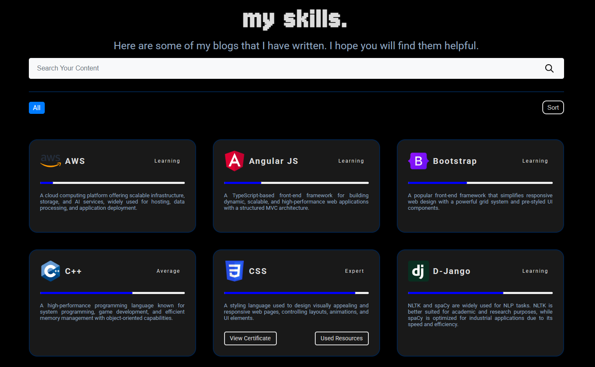
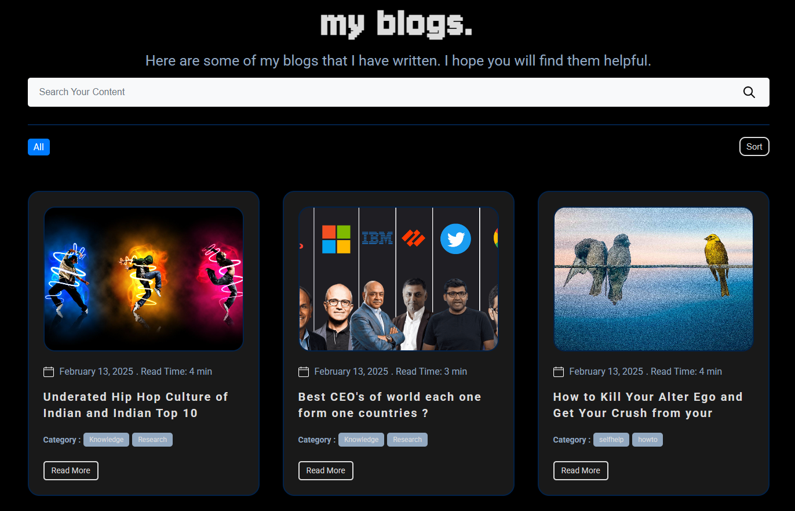
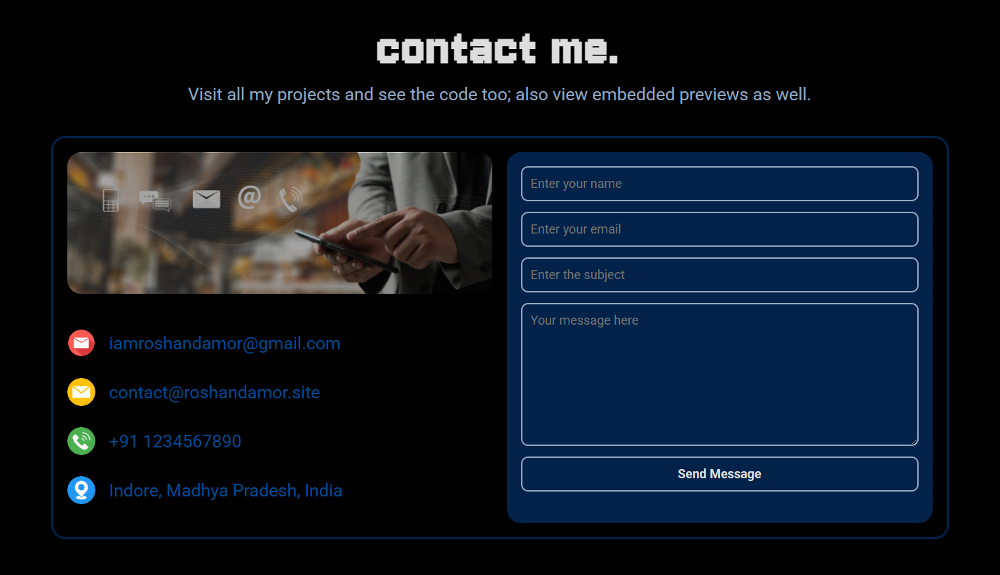

<div align="center">

# 🌟 Roshan's Desk - Modern Personal Portfolio


### 🚀 **Live Demo:** [portfoliov1.roshanproject.site](https://portfoliov1.roshanproject.site)


**A modern, fully responsive portfolio website built with Django featuring dynamic content management, interactive UI, and comprehensive admin dashboard.**

</div>

---

## 📋 Table of Contents

- [✨ Features](#-features)
- [🎯 Live Demo](#-live-demo)
- [📱 Screenshots](#-screenshots)
- [🛠️ Tech Stack](#️-tech-stack)
- [🚀 Installation & Setup](#-installation--setup)
- [📁 Project Structure](#-project-structure)
- [🔧 Configuration](#-configuration)
- [🌐 Deployment](#-deployment)
- [📖 API Documentation](#-api-documentation)
- [🤝 Contributing](#-contributing)
- [📞 Contact](#-contact)
- [📄 License](#-license)

---

## ✨ Features

### 🎨 **Frontend Features**
- **Premium Dark Mode Aesthetic** - Stunning dark blue/green linear gradients for a futuristic, deep-UI feel
- **Custom 1280px Grid System** - Mathematically perfect alignment across all pages (Terms, Projects, Blogs)
- **Advanced UI Interactions** - Dynamic JavaScript typewriter effects and custom blinking cursors
- **Flawless Sticky Navbar** - Seamless scrolling with `overflow-x: clip` to prevent layout breakage
- **Interactive Animations** - Smooth transitions, hover effects, and modern Glassmorphism UI
- **Fully Responsive Design** - Mobile-first approach with customized hamburger overlay menus

### 🔧 **Backend Features**
- **Django 5.2.5 Framework** - Latest Django with enhanced security and performance
- **Custom Jazzmin Admin Dashboard** - A completely customized, dark-mode themed CMS for managing all portfolio content natively
- **MySQL Database** - Robust relational database management
- **REST API Integration** - Django REST Framework backend architecture
- **Dynamic File System** - Secure upload management for Resumes, Blog Covers, and Project features
- **Email Integration** - Contact form with console/SMTP functionality

### 🛡️ **Security Features**
- **Environment Variables** - Secure credential management with python-dotenv
- **HTTPS Enforcement** - SSL/TLS configuration for production
- **CSRF Protection** - Cross-site request forgery protection
- **XSS Prevention** - Cross-site scripting security measures
- **Secure Headers** - Security headers for enhanced protection
- **Input Validation** - Comprehensive form validation and sanitization

### 📊 **Content Management**
- **Dynamic Projects** - Showcase projects with images, descriptions, and links
- **Blog System** - Full-featured blog with categories and rich text editor
- **Skills Management** - Interactive skills display with proficiency levels
- **Experience Timeline** - Professional experience with company details
- **FAQ Section** - Expandable FAQ system with categories
- **Resume Management** - PDF upload and display functionality

---

## 🎯 Live Demo

🌐 **Production Site:** [portfoliov1.roshanproject.site](https://portfoliov1.roshanproject.site)

Experience the fully deployed portfolio with all features active, including:
- Complete mobile responsiveness
- Working contact form with email notifications
- Interactive project showcases
- Dynamic blog system
- Downloadable resume functionality

---

## 📱 Screenshots

<div align="center">

### 🏠 Hero Section & Skills
<table>
<tr>
<td></td>
<td></td>
</tr>
</table>

### 📝 Blog System & Contact Form  
<table>
<tr>
<td></td>
<td></td>
</tr>
</table>

</div>

---

## 🛠️ Tech Stack

### **Backend**
- **Framework:** Django 5.2.5
- **Language:** Python 3.8+
- **Database:** MySQL 8.0
- **ORM:** Django ORM
- **API:** Django REST Framework
- **Authentication:** Django Auth System

### **Frontend**
- **Languages:** HTML5, CSS3, JavaScript (ES6+)
- **Styling:** Custom CSS with CSS Grid & Flexbox
- **Icons:** Font Awesome, Custom SVGs
- **Animations:** CSS Transitions & Keyframes
- **Responsive:** Mobile-first responsive design

### **DevOps & Deployment**
- **Web Server:** WhiteNoise for static files
- **Database:** MySQL with mysqlclient
- **Environment:** python-dotenv for configuration
- **Deployment:** cPanel hosting
- **Version Control:** Git & GitHub

### **Additional Tools**
- **Rich Text Editor:** TinyMCE for blog content
- **Email Backend:** SMTP integration
- **File Handling:** Django file upload system
- **Security:** CSRF, XSS protection, secure headers

---

## 🚀 Installation & Setup

### **Prerequisites**
```bash
- Python 3.8 or higher
- pip (Python package installer)
- MySQL 8.0 or higher
- Git
```

### **1. Clone Repository**
```bash
git clone https://github.com/logicbyroshan/portfolio-v1.0.git
cd portfolio-v1.0
```

### **2. Create Virtual Environment**
```bash
# Windows
python -m venv venv
venv\Scripts\activate

# macOS/Linux
python3 -m venv venv
source venv/bin/activate
```

### **3. Install Dependencies**
```bash
pip install -r requirements.txt
```

### **4. Environment Configuration**
```bash
# Copy environment template
cp .env.example .env

# Generate secure secret key
python generate_secret_key.py

# Edit .env file with your configurations
```

### **5. Database Setup**
```bash
# Create MySQL database
mysql -u root -p
CREATE DATABASE portfolio_db;
CREATE USER 'portfolio_user'@'localhost' IDENTIFIED BY 'your_password';
GRANT ALL PRIVILEGES ON portfolio_db.* TO 'portfolio_user'@'localhost';
FLUSH PRIVILEGES;

# Run migrations
python manage.py migrate

# Create superuser (optional)
python manage.py createsuperuser
```

### **6. Collect Static Files**
```bash
python manage.py collectstatic
```

### **7. Run Development Server**
```bash
python manage.py runserver
```

Visit `http://127.0.0.1:8000/` in your browser.

---

## 📁 Project Structure

```
portfolio-v1.0/
├── 📁 myportfolio/                 # Django project settings
│   ├── __init__.py
│   ├── asgi.py                     # ASGI configuration
│   ├── settings.py                 # Django settings (production-ready)
│   ├── urls.py                     # Main URL configuration
│   └── wsgi.py                     # WSGI configuration
├── 📁 app/                         # Main Django application
│   ├── 📁 migrations/              # Database migrations
│   │   ├── 0001_initial.py
│   │   ├── 0002_remove_project_features...
│   │   └── ...
│   ├── 📁 static/                  # Static files (CSS, JS, Images)
│   │   ├── 📁 css/
│   │   │   ├── style.css           # Main stylesheet
│   │   │   ├── admin_custom.css    # Jazzmin Dark Mode UI Overrides
│   │   │   ├── index.css           # Homepage styles
│   │   │   ├── blogs.css           # Blog-specific styles
│   │   │   └── ...
│   │   ├── 📁 js/
│   │   │   ├── index.js            # Main JavaScript functionality
│   │   │   └── contact.js          # Contact form handling
│   │   └── 📁 images/              # Static images
│   │       ├── 📁 icons/
│   │       ├── 📁 others/
│   │       └── 📁 stock/
│   ├── 📁 templates/               # HTML templates
│   │   ├── portfolio-base.html     # Base template
│   │   ├── portfolio-landing-page.html  # Homepage
│   │   ├── blogs.html              # Blog listing
│   │   ├── blog-detail.html        # Blog detail page
│   │   ├── projects.html           # Projects showcase
│   │   ├── project-detail.html     # Project detail page
│   │   ├── skills.html             # Skills page
│   │   ├── experiences.html        # Experience timeline
│   │   ├── faqs.html              # FAQ page
│   │   └── filters.html           # Reusable filter component
│   ├── admin.py                    # Django admin configuration
│   ├── apps.py                     # App configuration
│   ├── context_processors.py       # Template context processors
│   ├── forms.py                    # Django forms
│   ├── models.py                   # Database models
│   ├── urls.py                     # App URL patterns
│   └── views.py                    # View functions
├── 📁 media/                       # User uploaded files
│   ├── 📁 blogs/                   # Blog images
│   ├── 📁 projects/                # Project images
│   │   ├── 📁 images/
│   │   └── 📁 features/
│   ├── 📁 skills/                  # Skill icons & certificates
│   │   ├── 📁 icons/
│   │   └── 📁 certificates/
│   ├── 📁 experience/              # Company logos
│   └── 📁 resumes/                 # Resume PDFs
├── 📁 staticfiles/                 # Collected static files (production)
├── 📁 stock-images/                # Demo screenshots & assets
│   ├── Portfolio Thumb.jpg         # Cover image
│   ├── heross.png                  # Hero section screenshot
│   ├── skillss.png                 # Skills section screenshot
│   ├── blogsss.png                 # Blog page screenshot
│   └── contactss.png               # Contact form screenshot
├── 📁 logs/                        # Application logs
│   └── .gitkeep
├── 📄 manage.py                    # Django management script
├── 📄 requirements.txt             # Python dependencies
├── 📄 .env.example                 # Environment variables template
├── 📄 .gitignore                   # Git ignore rules
├── 📄 generate_secret_key.py       # Secret key generator utility
├── 📄 DEPLOYMENT.md                # Deployment instructions
└── 📄 README.md                    # Project documentation
```

---

## 🔧 Configuration

### **Environment Variables (.env)**
```bash
# Django Configuration
SECRET_KEY=your-secure-secret-key-here
DEBUG=False
ALLOWED_HOSTS=portfoliov1.roshanproject.site,www.roshanproject.site

# Database Configuration
DB_NAME=portfolio_db
DB_USER=portfolio_user
DB_PASSWORD=your_secure_password
DB_HOST=localhost
DB_PORT=3306

# Email Configuration
EMAIL_HOST=smtp.yourdomain.com
EMAIL_PORT=465
EMAIL_USE_SSL=True
EMAIL_HOST_USER=contact@yourdomain.com
EMAIL_HOST_PASSWORD=your_email_password
DEFAULT_FROM_EMAIL=contact@yourdomain.com

# Security Settings
SECURE_SSL_REDIRECT=True
SESSION_COOKIE_SECURE=True
CSRF_COOKIE_SECURE=True
```

### **Key Features Configuration**

#### **Database Models**
- **Project:** Showcase portfolio projects with images and descriptions
- **Blog:** Full-featured blog system with categories and content
- **Skill:** Technical skills with proficiency levels and certificates  
- **Experience:** Professional experience timeline
- **FAQ:** Frequently asked questions with categories
- **ContactMessage:** Contact form submissions storage

#### **Admin Interface**
Access at `/dash-admin/` with superuser credentials:
- **Jazzmin Powered:** Completely customized dark-mode CMS tailored to the portfolio's aesthetics
- Content management for all models seamlessly mapped to the UI
- Rich text editor embedded for blog posts
- Centralized file upload management for resumes and visual assets
- User and permission management

---

## 🌐 Deployment

The application is deployed on **cPanel hosting** at [portfoliov1.roshanproject.site](https://portfoliov1.roshanproject.site)

### **Production Features**
- **SSL/HTTPS Encryption** - Secure data transmission
- **MySQL Database** - Production-grade database
- **Static File Optimization** - Compressed and cached assets
- **Error Logging** - Comprehensive error tracking
- **Email Functionality** - Working contact form notifications

### **Deployment Steps**
1. **Prepare Environment** - Configure `.env` with production values
2. **Database Migration** - Set up MySQL and run migrations  
3. **Static Files** - Collect and optimize static assets
4. **cPanel Configuration** - Configure Python app settings
5. **SSL Setup** - Enable HTTPS certificate
6. **Testing** - Verify all functionality works correctly

📖 **Detailed Guide:** See [DEPLOYMENT.md](DEPLOYMENT.md) for complete instructions.

---

## 📖 API Documentation

### **Available Endpoints**
```bash
# Main Pages
/                          # Homepage with all sections
/projects/                 # Projects showcase
/projects/<int:id>/        # Project detail page
/blogs/                    # Blog listing
/blogs/<int:id>/           # Blog detail page
/skills/                   # Skills showcase  
/experiences/              # Experience timeline
/faqs/                     # FAQ page

# Admin Interface
/admin/                    # Django admin dashboard
/tinymce/                  # Rich text editor assets

# Media Files
/media/<path:path>         # User uploaded files
/static/<path:path>        # Static assets
```

### **Form Handling**
- **Contact Form:** AJAX-powered with email notifications
- **Search & Filter:** Dynamic content filtering across pages
- **File Uploads:** Resume and image upload functionality

---

## 🤝 Contributing

Contributions are welcome! Here's how you can help:

### **Getting Started**
1. **Fork** the repository
2. **Create** a feature branch (`git checkout -b feature/AmazingFeature`)
3. **Commit** your changes (`git commit -m 'Add some AmazingFeature'`)
4. **Push** to the branch (`git push origin feature/AmazingFeature`)
5. **Open** a Pull Request

### **Development Guidelines**
- Follow PEP 8 Python style guidelines
- Write meaningful commit messages
- Test your changes thoroughly
- Update documentation as needed
- Ensure mobile responsiveness

### **Areas for Contribution**
- 🐛 Bug fixes and improvements
- ✨ New features and enhancements  
- 📱 Mobile optimization
- 🎨 UI/UX improvements
- 📚 Documentation updates
- 🔒 Security enhancements

---

## 📞 Contact

<div align="center">

**Roshan Damor** - Full Stack Developer

[](https://portfoliov1.roshanproject.site)
[](mailto:contact@roshanproject.site)
[](https://github.com/logicbyroshan)
[](https://linkedin.com/in/roshandamor)

</div>

---

## 📄 License

```
MIT License

Copyright (c) 2025 Roshan Damor

Permission is hereby granted, free of charge, to any person obtaining a copy
of this software and associated documentation files (the "Software"), to deal
in the Software without restriction, including without limitation the rights
to use, copy, modify, merge, publish, distribute, sublicense, and/or sell
copies of the Software, and to permit persons to whom the Software is
furnished to do so, subject to the following conditions:

The above copyright notice and this permission notice shall be included in all
copies or substantial portions of the Software.

THE SOFTWARE IS PROVIDED "AS IS", WITHOUT WARRANTY OF ANY KIND, EXPRESS OR
IMPLIED, INCLUDING BUT NOT LIMITED TO THE WARRANTIES OF MERCHANTABILITY,
FITNESS FOR A PARTICULAR PURPOSE AND NONINFRINGEMENT. IN NO EVENT SHALL THE
AUTHORS OR COPYRIGHT HOLDERS BE LIABLE FOR ANY CLAIM, DAMAGES OR OTHER
LIABILITY, WHETHER IN AN ACTION OF CONTRACT, TORT OR OTHERWISE, ARISING FROM,
OUT OF OR IN CONNECTION WITH THE SOFTWARE OR THE USE OR OTHER DEALINGS IN THE
SOFTWARE.
```

---

<div align="center">

### 🌟 **Star this repository if you found it helpful!** 🌟

**Made with ❤️ by [Roshan Damor](https://github.com/logicbyroshan)**

*Last Updated: October 2025*

</div>
